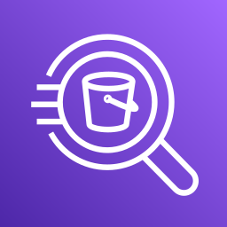
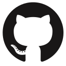
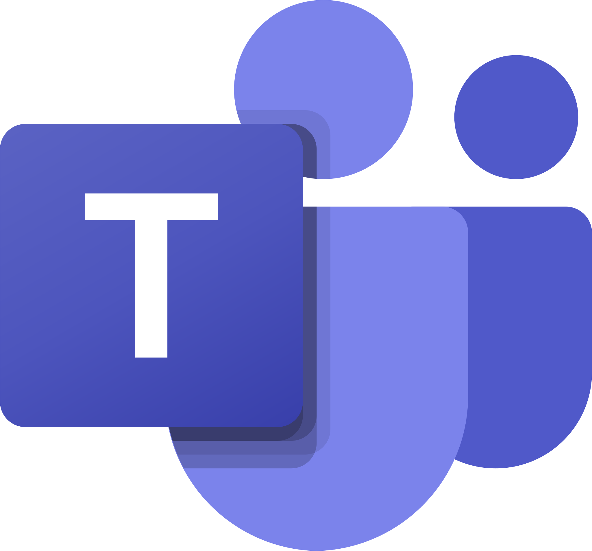
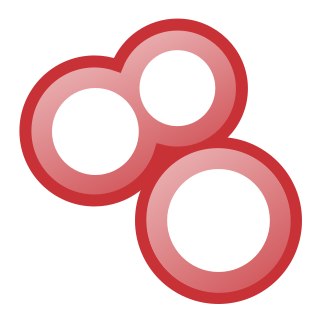
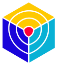

## AutobotAI Integrations Overview

The AutobotAI integrations operate on two primary foundations: the Python SDK and Steampipe. Each integration is designed to leverage these technologies for distinct purposes, ensuring flexibility and functionality across different use cases.

### 1. **Steampipe (No-Code Action)**
Steampipe-based integrations are referred to as **No-Code Actions**. These actions are primarily used for data fetching operations, also known as **Fetcher Actions**. They allow users to retrieve data without needing to write custom code, making it easy to gather and analyze information from various sources.

### 2. **Python SDK (Code Action)**
Python-based integrations are designed for more complex operations such as creating, editing, deleting, or executing other custom actions. These **Code Actions** provide users with the ability to perform mutations on data, offering flexibility for tailored automation and processing.

### Overview of Integration Capabilities

Below is a comprehensive overview of the support for both No-Code and Code Actions across the various integrations:

| Integration | Supports No-Code Action | Supports Code Action | How to Integrate |
|:---:|:---:|:---:|:---:|
|  **AbuseIPDB** | ✅ | ✅ | [link](./integrations/abuseipdb/Integrate.md)|
|  **AWS** | ✅ | ✅ | [link](./integrations/aws/Integrate.md)|
|  **AWS Athena** | ❌ | ✅ | [link](./integrations/aws_athena/Integrate.md)|
|  **AWS Bedrock** | ❌ | ✅ | [link](./integrations/aws_bedrock/Integrate.md)|
|  **AWS Security Lake** | ❌ | ✅ | [link](./integrations/aws_security_lake/Integrate.md)|
|  **AWS SES** | ❌ | ✅ | [link](./integrations/aws_ses/Integrate.md)|
|  **Azure** | ✅ | ✅ | [link](./integrations/azure/Integrate.md)|
|  **Azure Entra ID** | ✅ | ✅ | [link](./integrations/azure_entra_id/Integrate.md)|
|  **Cloudflare** | ✅ | ❌ | [link](./integrations/cloudflare/Integrate.md)|
|  **Coralogix** | ❌ | ✅ | [link](./integrations/coralogix/Integrate.md)|
|  **CrowdStrike** | ✅ | ❌ | [link](./integrations/crowdstrike/Integrate.md)|
|  **Datadog** | ✅ | ✅ | [link](./integrations/datadog/Integrate.md)|
|  **Email** | ✅ | ✅ | [link](./integrations/email/Integrate.md)|
|  **GCP** | ✅ | ✅ | [link](./integrations/gcp/Integrate.md)|
|  **GitHub** | ✅ | ✅ | [link](./integrations/github/Integrate.md)|
|  **Git** | ❌ | ✅ | [link](./integrations/git/Integrate.md)|
|  **GitGuardian** | ✅ | ✅ | [link](./integrations/gitguardian/Integrate.md)|
|  **GitLab** | ✅ | ✅ | [link](./integrations/gitlab/Integrate.md)|
|  **Grafana** | ✅ | ❌ | [link](./integrations/grafana/Integrate.md)|
|  **Google Chat** | ❌ | ✅ | [link](./integrations/google_chat/Integrate.md)|
|  **IPInfo** | ✅ | ❌ | [link](./integrations/ipinfo/Integrate.md)|
|  **IPStack** | ✅ | ❌ | [link](./integrations/ipstack/Integrate.md)|
|  **Jira** | ✅ | ✅ | [link](./integrations/jira/Integrate.md)|
|  **Kubernetes** | ✅ | ✅ | [link](./integrations/kubernetes/Integrate.md)|
|  **Linux** | ✅ | ✅ | [link](./integrations/linux/Integrate.md)|
|  **Microsoft Teams** | ❌ | ✅ | [link](./integrations/ms_teams/Integrate.md)|
|  **Microsoft Office 365** | ✅ | ✅ | [link](./integrations/microsoft_office_365/Integrate.md)|
|  **New Relic** | ✅ | ❌ | [link](./integrations/newrelic/Integrate.md)|
|  **OpenAI** | ✅ | ✅ | [link](./integrations/openai/Integrate.md)|
|  **Ollama** | ❌ | ✅ | [link](./integrations/ollama/Integrate.md)|
|  **Prometheus** | ✅ | ✅ | [link](./integrations/prometheus/Integrate.md)|
|  **Python** | ❌ | ✅ | [link](./integrations/python/Integrate.md)|
|  **Shodan** | ✅ | ✅ | [link](./integrations/shodan/Integrate.md)|
|  **Slack** | ✅ | ✅ | [link](./integrations/slack/Integrate.md)|
|  **Splunk** | ✅ | ✅ | [link](./integrations/splunk/Integrate.md)|
|  **Trivy** | ✅ | ❌ | [link](./integrations/trivy/Integrate.md)|
|  **Uptimerobot** | ✅ | ❌ | [link](./integrations/uptimerobot/Integrate.md)|
|  **URLScan** | ✅ | ❌ | [link](./integrations/urlscan/Integrate.md)|
|  **VirusTotal** | ✅ | ✅ | [link](./integrations/virustotal/Integrate.md)|
|  **WHOIS** | ✅ | ❌ | [link](./integrations/whois/Integrate.md)|
|  **Wiz** | ✅ | ❌ | [link](./integrations/wiz/Integrate.md)|
