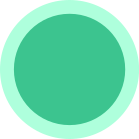

## AutobotAI Integrations Overview

The AutobotAI integrations operate on two primary foundations: the Python SDK and Steampipe. Each integration is designed to leverage these technologies for distinct purposes, ensuring flexibility and functionality across different use cases.

### 1. **Steampipe (No-Code Action)**
Steampipe-based integrations are referred to as **No-Code Actions**. These actions are primarily used for data fetching operations, also known as **Fetcher Actions**. They allow users to retrieve data without needing to write custom code, making it easy to gather and analyze information from various sources.

### 2. **Python SDK (Code Action)**
Python-based integrations are designed for more complex operations such as creating, editing, deleting, or executing other custom actions. These **Code Actions** provide users with the ability to perform mutations on data, offering flexibility for tailored automation and processing.

### Overview of Integration Capabilities

Below is a comprehensive overview of the support for both No-Code and Code Actions across the various integrations:

| Integration | Supports No-Code Action | Supports Code Action | How to Integrate |
|:---:|:---:|:---:|:---:|
|  **AbuseIPDB** | ✅ | ❌ | [link](./abuseipdb/Integrate.md)|
|  **Google APIs** | ✅ | ✅ | [link](./google_api/Integrate.md)|
|  **Slack** | ✅ | ✅ | [link](./slack/Integrate.md)|
<!--
|  **AWS** | ✅ | ✅ | [link](./aws/Integrate.md)|
|  **AWS Athena** | ❌ | ✅ | [link](./aws_athena/Integrate.md)|
|  **AWS Bedrock** | ❌ | ✅ | [link](./aws_bedrock/Integrate.md)|
|  **AWS Security Lake** | ❌ | ✅ | [link](./aws_security_lake/Integrate.md)|
|  **AWS SES** | ❌ | ✅ | [link](./aws_ses/Integrate.md)|
|  **Azure** | ✅ | ✅ | [link](./azure/Integrate.md)|
|  **Azure Entra ID** | ✅ | ✅ | [link](./azure_entra_id/Integrate.md)|
|  **Cloudflare** | ✅ | ❌ | [link](./cloudflare/Integrate.md)|
|  **Coralogix** | ❌ | ✅ | [link](./coralogix/Integrate.md)|
|  **CrowdStrike** | ✅ | ❌ | [link](./crowdstrike/Integrate.md)|
|  **Datadog** | ✅ | ✅ | [link](./datadog/Integrate.md)|
|  **Email** | ✅ | ✅ | [link](./email/Integrate.md)|
|  **GCP** | ✅ | ✅ | [link](./gcp/Integrate.md)|
|  **GitHub** | ✅ | ✅ | [link](./github/Integrate.md)|
|  **Git** | ❌ | ✅ | [link](./git/Integrate.md)|
|  **GitGuardian** | ✅ | ✅ | [link](./gitguardian/Integrate.md)|
|  **GitLab** | ✅ | ✅ | [link](./gitlab/Integrate.md)|
|  **Grafana** | ✅ | ❌ | [link](./grafana/Integrate.md)|
|  **Google Chat** | ❌ | ✅ | [link](./google_chat/Integrate.md)|
|  **IPInfo** | ✅ | ❌ | [link](./ipinfo/Integrate.md)|
|  **IPStack** | ✅ | ❌ | [link](./ipstack/Integrate.md)|
|  **Jira** | ✅ | ✅ | [link](./jira/Integrate.md)|
|  **Kubernetes** | ✅ | ✅ | [link](./kubernetes/Integrate.md)|
|  **Linux** | ✅ | ✅ | [link](./linux/Integrate.md)|
|  **Microsoft Teams** | ❌ | ✅ | [link](./ms_teams/Integrate.md)|
|  **Microsoft Office 365** | ✅ | ✅ | [link](./microsoft_office_365/Integrate.md)|
|  **New Relic** | ✅ | ❌ | [link](./newrelic/Integrate.md)|
|  **OpenAI** | ✅ | ✅ | [link](./openai/Integrate.md)|
|  **Ollama** | ❌ | ✅ | [link](./ollama/Integrate.md)|
|  **Prometheus** | ✅ | ✅ | [link](./prometheus/Integrate.md)|
|  **Python** | ❌ | ✅ | [link](./python/Integrate.md)|
|  **Shodan** | ✅ | ✅ | [link](./shodan/Integrate.md)|
|  **Splunk** | ✅ | ✅ | [link](./splunk/Integrate.md)|
|  **Trivy** | ✅ | ❌ | [link](./trivy/Integrate.md)|
|  **Uptimerobot** | ✅ | ❌ | [link](./uptimerobot/Integrate.md)|
|  **URLScan** | ✅ | ❌ | [link](./urlscan/Integrate.md)|
|  **VirusTotal** | ✅ | ✅ | [link](./virustotal/Integrate.md)|
|  **WHOIS** | ✅ | ❌ | [link](./whois/Integrate.md)|
|  **Wiz** | ✅ | ❌ | [link](./wiz/Integrate.md)|
-->