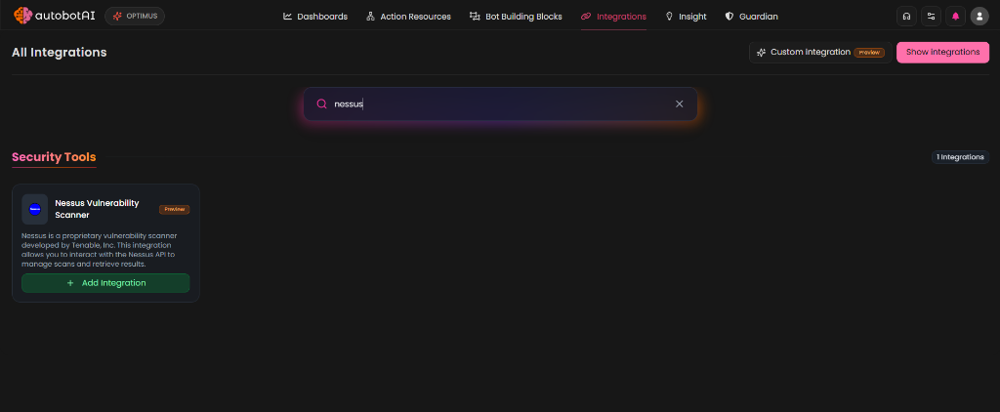
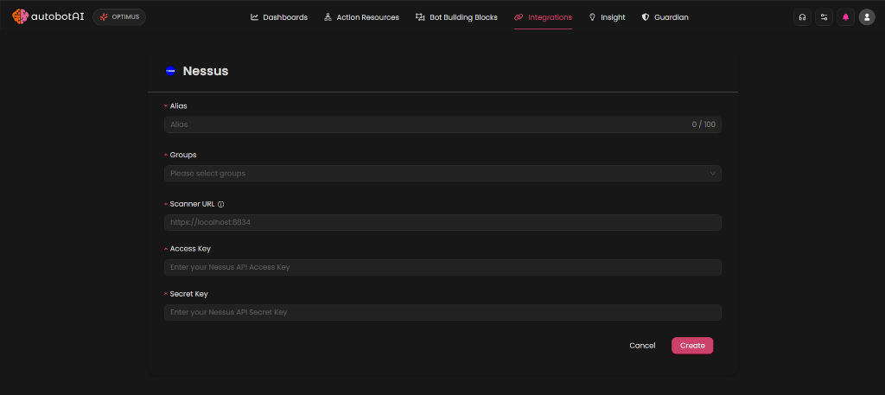

# Integrate Nessus

## Overview

Nessus is a widely deployed vulnerability assessment solution designed to identify security vulnerabilities, misconfigurations, and compliance gaps across IT infrastructure. By integrating Nessus with AutobotAI, you can automate vulnerability scanning, monitor scan statuses, and retrieve vulnerability details directly within your automation pipelines.

## What You’ll Need

### Nessus API Credentials

To connect AutobotAI with Nessus, you need the URL of your Nessus server along with API authentication keys (`Access Key` and `Secret Key`).

### Where to Find Your API Keys

1. **Login**: Access your Nessus web dashboard (typically hosted on port `8834`).
2. **Account Settings**: Navigate to **Settings** -> **My Account** -> **API Keys**.
3. **Generate Keys**: Click **Generate** to create a new pair of `Access Key` and `Secret Key`. Make sure to copy and store them securely as they will not be shown again.

## How to Integrate

### 1. Configure Connection

1. **Access the Integrations Page**: Navigate to the integrations catalog in AutobotAI, click on `Add integration`, and select `Nessus`.

2. **Enter Details**: Provide your Nessus server URL (e.g., `https://localhost:8834`), `Access Key`, and `Secret Key`. You can also configure SSL verification preferences.

3. **Save Integration**: Click the `Create` button to verify credentials and save the integration.

## Automated Capabilities

Using the Python SDK Code Action support, you can build automated workflows to:
- **Launch Scans**: Dynamically trigger automated scans against newly provisioned cloud instances or network subnets.
- **Report & Alert**: Automatically fetch vulnerability summaries and report critical findings to communication channels or ticketing systems.

## Additional Resources

- [Tenable Nessus Developer Documentation](https://developer.tenable.com/)
